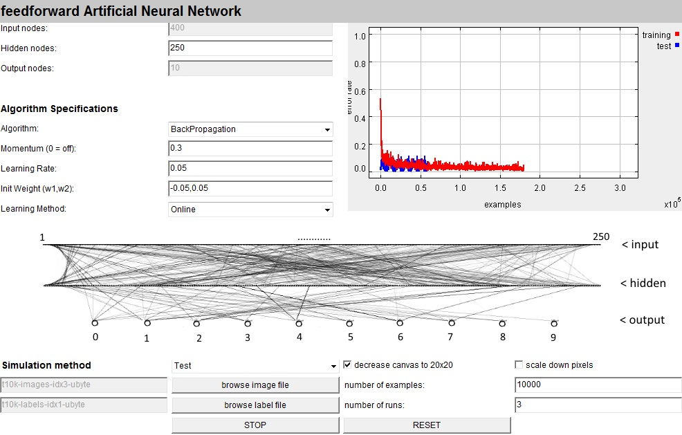
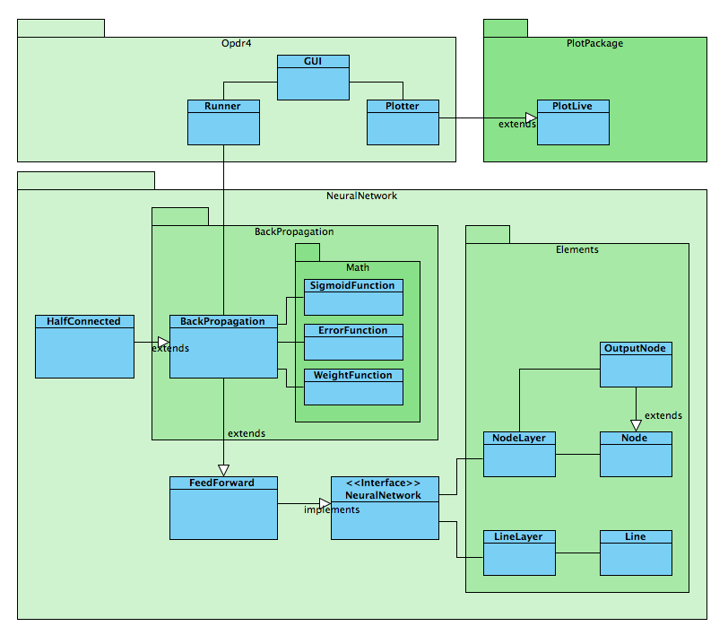

# handwriting-recognition

### Learning to recognize handwritten digits using a Neural Network

In this project I have developed the "classical" neural network example: Recognizing digits using the MNIST database. The network has to be trained using this dataset. After training, the neural network can be tested on a testset and it should give reasonable answers. The results (percentage wrong and the time to learn) are described using a plot.

The project is built up as follows:

The coded of this project is extensively documented, so please have a look if you have any questions about the details of the project.
